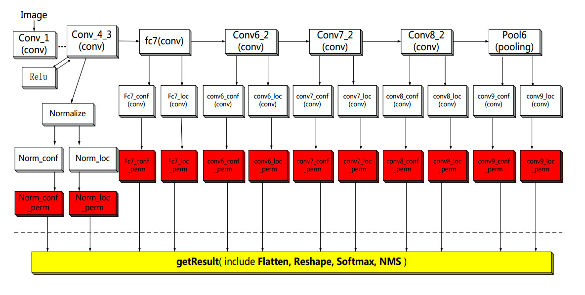

# DetectorSamples

目前SSD和YOLO是工业界使用最多的两种检测器。最近整理了一下自己实现的SSD,YOLOV3和YOLOV5推理代码，项目虽然是基于OpenCV实现的，但是由于使用的是onnx模型，所以代码可以很容易移植到TensorRT,NCNN等其他C++推理框架。在实现的过程中基本是参考了原作者的开源代码，也参考了网上的一些代码，由于记不清出处，这里无法给出参考代码的地址，这里感谢各位作者。希望自己的工作能够帮助更多初学者学习SSD和YOLO。

## 目录
- [目录结构](#目录结构)
- [构建安装](#构建安装)
- [运行](#运行)
- [模型转换说明](#模型转换说明)

## 目录结构
```
├── 3rdParty:依赖库
├── Resource:资源文件目录，包括模型，测试图像等
│   └── Models:示例模型
│   └── TestImage:测试图像
│   └── Configuration.xml:配置文件
├── Src
│   └── Detector:检测器源码
│   └── Utility:工具
│   └── Sample.cpp:示例程序
│   └── main.cpp
├── CMakeLists.txt
├── README.md
├── requirements.txt

```
## 构建安装


### 安装rbuild
当前目录为工程根目录

```
sh ./3rdParty/InstallRBuild.sh
```

### 安装OpenCV依赖
```
sh ./3rdParty/InstallOpenCVDependences.sh
```
注意:根据不同的linux系统,选择脚本中相应的安装方式,默认为centos系统

### 修改CMakeLists.txt
如果使用ubuntu系统，需要修改CMakeLists.txt中依赖库路径：
将"${CMAKE_CURRENT_SOURCE_DIR}/depend/lib64/"修改为"${CMAKE_CURRENT_SOURCE_DIR}/depend/lib/"

### 安装OpenCV并编译工程
当前目录为工程根目录

```
rbuild build -d depend
```

### 设置环境变量

将OpenCV库路径加入环境变量LD_LIBRARY_PATH，在~/.bashrc中添加如下语句：

**Centos**:
```
export LD_LIBRARY_PATH=项目根目录/depend/lib64/:$LD_LIBRARY_PATH
```
**Ubuntu**:

```
export LD_LIBRARY_PATH=项目根目录/depend/lib/:$LD_LIBRARY_PATH
```

然后执行:
```
source ~/.bashrc
```

## 运行
```
cd ./build/
./DetectorSamples
```
根据提示选择要运行的示例程序，比如执行
```
./DetectorSamples 0
```
运行SSD示例程序,会在当前目录下生成检测结果图像Result.jpg

## 模型转换说明
### SSD模型
与分类模型不同，SSD模型较为复杂，而且不同训练框架实现SSD的方式不同，同时不同的推理框架支持的算子不同，这就给转换为onnx模型带来了较大困难。一般情况下我们需要对训练好的SSD模型做一些修改才能够在特定推理框架上使用，基本的思路就是：onnx模型中只包含原始网络的一部分，让onnx包含的一部分在GPU上运行，剩下的都在CPU上运行。这里提供一种修改SSD网络结构的参考方案，这种方案可以在绝大部分推理框架中使用(目前在OpenCV,TensorRT中都测试通过)。

#### 修改SSD网络结构

onnx模型中只保留到permute层的前一层，permute层以及后面的所有层全部在CPU上运行。

<p align="left"></p>

图中红色的部分和黄色部分都是在CPU上执行，其他都是在GPU上执行。Resource/Models/SSD/目录下提供了这种方案的模型转换示例，其中train.prototxt为训练网络结构，deploy.prototxt为推理网络结构，deploy.prototxt对应的onnx版本为deploy_Caffe2ONNX.prototxt，转换为onnx模型的时候需要使用deploy_Caffe2ONNX.prototxt，caffe模型转onnx参考https://github.com/htshinichi/caffe-onnx，本示例训练使用的caffe工程地址:https://github.com/qianqing13579/Caffe_SSD_YOLOV3 。如果你使用其他框架训练SSD则需要按照caffe的实现方式作出相应的修改。模型转换成功后需要修改 Resource/Configuration.xml中SSD网络结构参数，xml中对每个参数的含义作出了详细的解释。具体代码实现参考Src/Detector/目录下的SSD检测器。

本示例中对SSD网络结构的修改的方式同样可以应用到其他复杂网络，比如后面提到的YOLOV3,YOLOV5等,这里就不再一一赘述了。

### YOLOV3模型
Resource/Models/YOLOV3/目录下提供了模型转换示例，其中train.prototxt为训练网络结构，deploy.prototxt为推理网络结构，deploy.prototxt对应的onnx版本为deploy_Caffe2ONNX.prototxt，转换为onnx模型的时候需要使用deploy_Caffe2ONNX.prototxt，本示例训练使用的caffe工程地址:https://github.com/qianqing13579/Caffe_SSD_YOLOV3。模型转换成功后需要修改 Resource/Configuration.xml中YOLOV3网络结构参数，xml中对每个参数的含义作出了详细的解释。

### YOLOV5模型
Resource/Models/YOLOV5/提供了YOLOV5示例模型，本示例模型使用的是https://github.com/ultralytics/yolov5 中提供的模型，需要注意的是官方的YOLOV5模型中的Focus模块使用到了步长为2的切片操作,OpenCV暂时不支持该操作,在转换为onnx模型的时候对这部分做了修改，使用view和permute操作代替(这部分代码官方代码中也提供了，只是被注释掉了)，具体修改方法参考Resource/Models/YOLOV5/yolov5s.onnx模型。